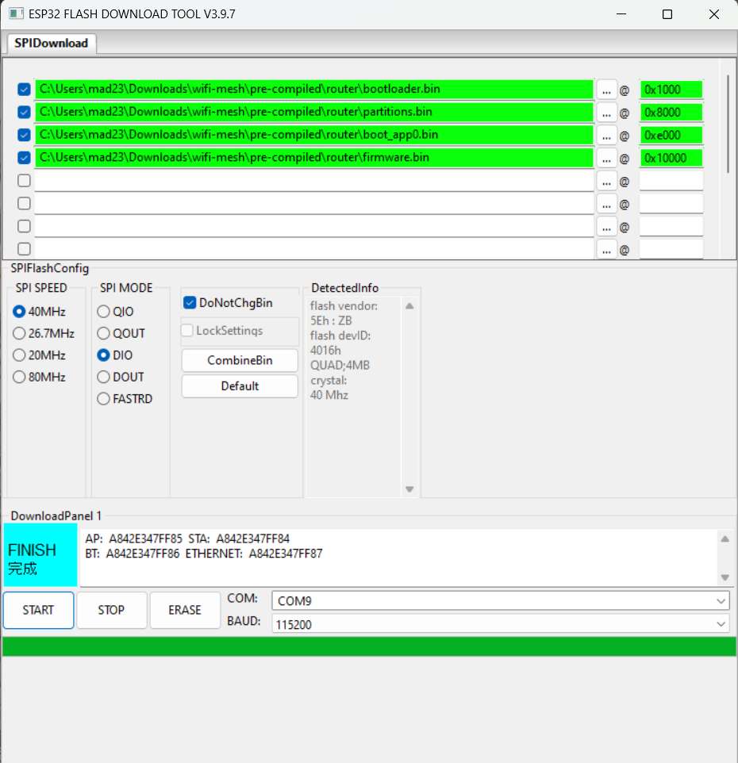
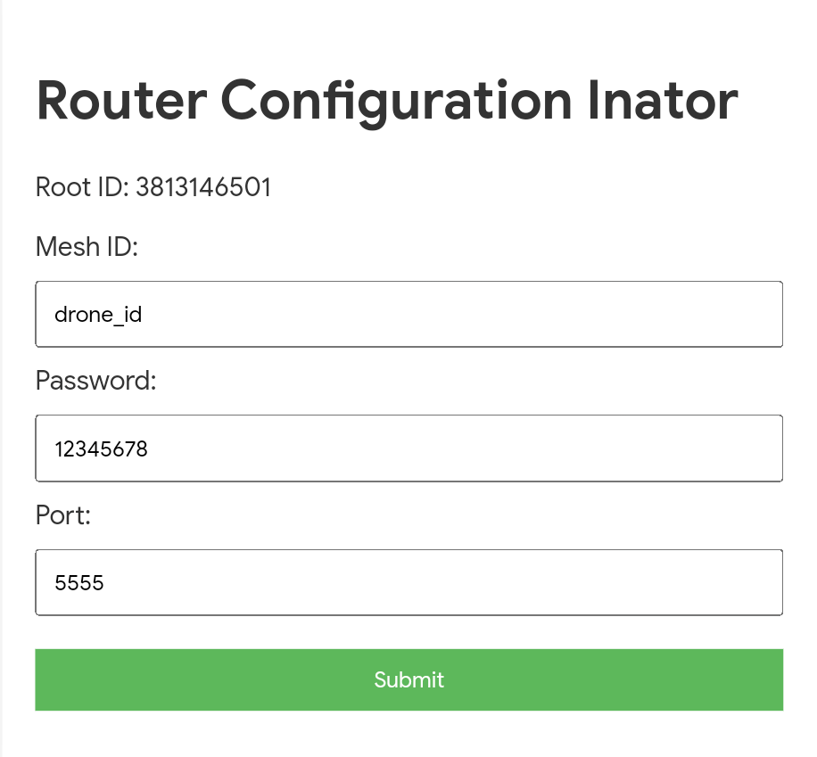
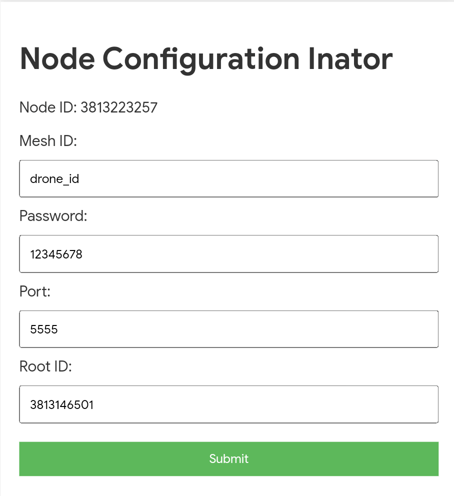

# Installation

**[NOTE: The pre-compiled binary is for ESP32]**
1. **Download release binary.**
2. **Upload them to ESP via ESP flash tools.**  
   
3. **Do the configuration step twise, because rootID for devices wont display correctly at first boot**

# Configuration

1. **Connect a button to pin 2.** This button is for getting ESP32 into config mode.
2. **To get into config mode, press and hold the pair button, then press the reset button.**
3. **Once done, the ESP goes to access point mode. Depending on node or router, the SSID will change.**
4. **Connect to the respective ESP access point, then on your browser go to this URL: [http://192.168.4.1](http://192.168.4.1)**

### Router Configuration

 
Configure the necessary parameters and note the Root ID. In this case, it is `3813146501`.

### Node Configuration

  
Configure the necessary parameters. Ensure that the Mesh ID, Password, and Port are the same as the router. For the Root ID, enter the ID which was previously noted.

5. **Configuration Done**

# Use

1. **Connect the router ESP to your PC using 921600 baud.**
2. **Connect the node to the drone with 921600 baud.**
3. **If you are using multiple vehicles, change the `SYSID_THISMAV` parameter.**
